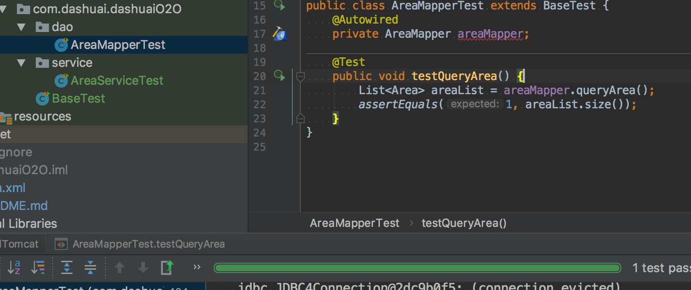
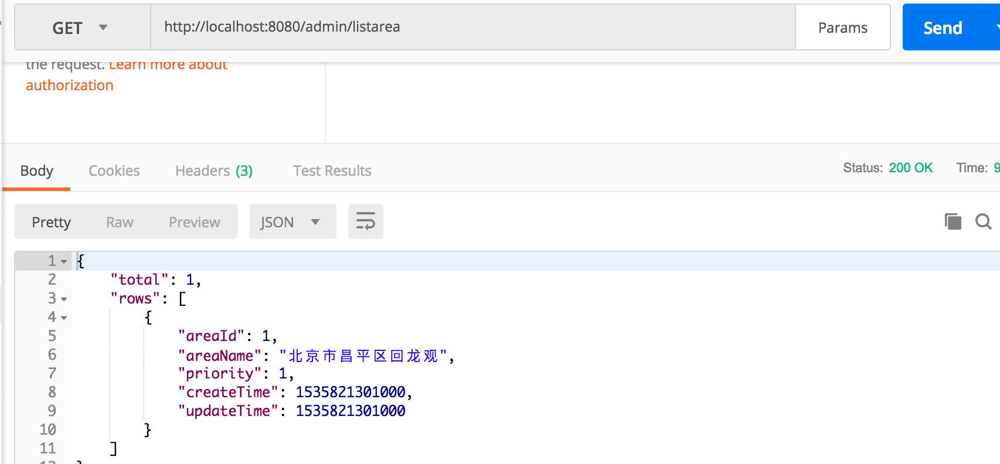

# dashuaiO2O
我的学习项目，Mac + idea

## 技术栈
* SSM（SpringBoot）搭建了项目的框架
* 数据库连接池(HiKariCP)
* 前后端分离，动静分离
* Redis 缓存
* MySQL innodb 及其读写分离配置
* 事务
* 单元测试
* 部署、运维自动化脚本
* logback 日志组件

## 开发记录
### tag 1.0.0
##### 1、tag 1.0.0 项目结构
* opt 部署脚本
* src/main/java/com/dashuai/dashuaiO2O/
   * entity：实体
   * service：业务逻辑
   * web
   * dao
   * dto
   * enums
   * interceptor：拦截器
   * util: 通用工具类
* src/main/resources/
   * database
      * schema.sql 数据库脚本
   * spring spring框架的配置文件
   * mapper 数据映射配置文件
   * 所依赖的其它工具（框架）的配置文件
* src/main/webapp/
   * resources 存储静态资源
   * WEB-INF 目录安全性的应用：把视图解析器前缀定义为 WEB-INF/html 可以保证这些 html 文件不能直接通过 URL 访问，但程序内部可以访问
   
##### 2、tag 1.0.0 开发日志
* markdown [语法参考](https://www.jianshu.com/p/191d1e21f7ed)
* [idea 配置 tomcat](http://www.cnblogs.com/Miracle-Maker/articles/6476687.html) 
* 使用SSM，idea 配置 tomcat的时候遇到权限问题，需要修改 bin下的 *.sh 文件权限
* [idea maven 配置 java web 项目](https://www.cnblogs.com/zhangyinhua/p/7768163.html#_label1)
* web.xml 版本配置 
   * [不同版本(2.3,2.4,2.5,3.0)的Servlet web.xml 头信息](https://blog.csdn.net/z69183787/article/details/36008097) 
   * [初用idea建立javaweb遇到的问题与心得](https://www.cnblogs.com/red-code/p/5933268.html)
   * [maven web项目中web.xml](https://www.cnblogs.com/saliency/p/5563842.html)
* MySQL 时间数据类型比较和分析 
   * [官网 The DATE, DATETIME, and TIMESTAMP Types](https://dev.mysql.com/doc/refman/5.7/en/datetime.html)
   * [MySQL数据类型--日期和时间类型](https://blog.csdn.net/u011794238/article/details/50914444)
* MySQL CHAR 和 VARCHAR 类型
   * [官网 CHAR 和 VARCHAR 类型](https://dev.mysql.com/doc/refman/5.7/en/char.html)
   * [MySql 中 varchar 和varchar 的区别](https://blog.csdn.net/dearwind153/article/details/52416408)
   * [Stack Overflow ： What are the optimum varchar sizes for MySQL?](https://stackoverflow.com/questions/1151667/what-are-the-optimum-varchar-sizes-for-mysql)
* MySQL 的不同版本给定的索引长度不同，要注意设置最大长度的范围问题
* 关于外键的添加问题小结
   * 阿里规约里虽然不提倡，但是也要看项目的使用场景和体量，数据多的时候，千万级别的一般要分表分库，这时单数据库的外键已没有了意义，
   此时不用加外键。而一般情况下，数据量只有百万级别及其以下的项目，其数据表可以加外键，通过外键约束一些行为，也自动给加了索引，能提升数据库性能。
   没有绝对的对与错，需要结合实际业务去考虑
   * 添加外键失败的原因，多数有以下原因：
      1. 两张表里，主键和外键字段的数据类型或者数据长度不一样 
      2. 表里已经有记录了
      3. 设定了外键，表面表之间有依赖关系，也就是有先后顺序，创建一个带外键的表之前，要先把外键参照的表建好
* 数据库连接池小结
   * [HikariCP](https://github.com/brettwooldridge/HikariCP)
   * [HiKariCP数据库连接池](https://blog.csdn.net/zhuguorong11/article/details/74941899)
   * 没使用数据库连接池之前
      1. 使用时连接数据库，使用后断开数据库
      2. 对于每一次数据库连接，使用完后都得断开。否则，如果程序出现异常而未能关闭，将会导致数据库系统中的内存泄漏，最终将导致重启数据库。
      3. 如果成千上万的用户同时使用数据库，频繁的进行数据库连接操作将占用很多的系统资源，严重的甚至会造成服务器的崩溃。
   * 数据库连接池技术的优点
      1. 资源重用：数据库连接得以重用，避免了频繁创建释放引起的性能开销。在减少系统消耗的基础上，也增加了系统运行环境的平稳性
      2. 更快的反应速度: 数据库连接池在初始化过程中，往往已经创建了若干数据库连接置于池中备用，此时连接的初始化工作已完成。对于业务请求而言，
      直接利用现有可用连接，避免了数据库连接初始化和释放过程的时间开销，从而减少了系统的响应时间
   * 数据库连接池的思想是为数据库连接建立“缓冲池”
      * 预先在缓冲池中放入一定数量的连接，当需要建立连接时，只需从“缓冲池”中取出一个，使用完毕再放回去，连接池负责分配、管理和释放数据库连接，
      它允许应用程序重复使用一个现有的数据库连接，而不是重新建立一个。数据库连接池在初始化时将创建一定数量的连接放到连接池中，连接的数量是由最小数据库连接数
      来设定的。无论数据库连接是否被使用，连接池都将一直保证至少拥有这么多的连接数量。连接池的最大数据库连接数限定了这个连接池能占有的最大连接数，当程序向连
      接池请求连接数超过最大连接数时，这些请求将被加入到等待队列
* MyBatis 的全局配置（自下而上的顺序配置，先数据库，然后映射器。。。spring-dao.xml。。。最后在 web.xml 里整合）
   * [参考官网 XML 映射配置文件](http://www.mybatis.org/mybatis-3/zh/configuration.html)
   * [MyBatis xml配置文件详解](https://blog.csdn.net/summer_yuxia/article/details/53169227)
   * 在使用mybatis框架的时候，需要生成 sqlSessionFactory，sqlSessionFactory 是一个工厂类，他会根据我们的配置生产出我们需要的数据库连接池。
* Spring 配置：spring 繁杂配置的分离思想，参考 [分离你的spring配置文件，让结构更清晰](https://www.cnblogs.com/linkstar/p/6709206.html)
   * 配置 spring-dao.xml：主要是jdbc连接，MyBatis 的 sqlSessionFactory 等配置，总之和数据库打交道，参考 [spring-dao配置](https://blog.csdn.net/yzllz001/article/details/54809231)
      1. 找出需要去读取变量的一个文件的位置
      2. 配置数据库的连接池 
         * 完整配置参考 [Spring4.3入门 Spring 整合hikari](https://blog.csdn.net/qq_21586623/article/details/78586398)
         * 配置项详解参考 [hikariCP连接池配置](https://my.oschina.net/u/2300159/blog/1816537)
      3. 创建一个用来创建数据库连接池的对象：在使用 mybatis 框架时，需要生成 sqlSessionFactory 工厂类，他会根据我们的配置生产出我们需要的数据库连接池
      4. 配置去哪一个包扫描 dao 接口，并且将自动创建的连接池对象传进去
   * 配置 spring-service.xml: 主要是事务、扫描、注解等配置，参考 [spring service层配置](https://blog.csdn.net/yzllz001/article/details/54809303)
   * 配置 spring-web.xml: springMVC的相关配置，参考[spring-web.xml](https://blog.csdn.net/ACMer_AK/article/details/71774511)
      * [SpringMVC介绍之视图解析器ViewResolver](http://elim.iteye.com/blog/1770554)
* 整合分离的 Spring 配置文件：在 web.xml 里整合，可以参考 
   * [web.xml中servlet配置及其含义](https://blog.csdn.net/m0_37630602/article/details/65443660)
   * [ssm整合基本配置之web.xml](http://592502042.iteye.com/blog/2405787)
   1. 配置 DispatcherServlet： DispatcherServlet 主要负责流程的控制。
      * 指定 SpringMVC 的 DispatcherServlet 类
      * 通过 contextConfigLocation 装入 spring 配置文件，参考[web.xml中的contextConfigLocation在spring中的作用](https://blog.csdn.net/zhangliao613/article/details/6289114)
      * 为 DispatcherServlet 设置映射规则，参考 [web.xml中的url-pattern详解](https://blog.csdn.net/qq_25218095/article/details/51788063)
* 验证配置的正确性，可以选一个简单的数据库表，依次对 dao，service, controller 进行单元测试
   * dao 只是一个接口，不用加注解
   * service：实现类中需要加入 @Service，表示这是一个 service 层的实现类，spring IOC 容器将会自动将其注入
   * 属性上使用 @Autowired，告诉spring，我这里想要用到某一个对象，请你将它注入进来。
   * controller：需要加入 @Controller/@RestController 同 @service (@RestController注解相当于@ResponseBody ＋ @Controller合在一起的作用,简化了 rest 服务的开发)，
      * @RequestMapping()，自定义路由。
      * @ResponseBody，将返回的数据设置为json格式
   * 单元测试：
      * @RunWith(SpringJUnit4ClassRunner.class)，使用括号里面的类来进行单元测试。
      * @ContextConfiguration()，类启动时，加载括号中指定的配置文件
      * 
   * 基本流程：
      * 在 dao 层创建出我们想要的对象的接口，然后定义相关方法
      * 在 mapper 中创建出与这个dao接口对应的xml文件，在xml文件里面定义方法所需要用到的sql语句
      * 在 service 层调用 dao 的方法，返回我们想要的数据，将它返回到 contorller 里面
      * contorller 获取到这些数据之后，直接将它返回前端
* 也可以使用 postman 进行测试
   * 
* SSM 整合小结
   1. 阅读 DispatcherServlet 源码，了解请求分发
   2. IOC, 由 Spring 控制对象的生命周期和对像间的关系，而非传统实现中由程序代码直接 new, IOC 通过 DI 实现。
   3. AOP，面向切面编程，动态代理，jdk 和 cglib
   4. MyBatis:ORM 框架的一种轻便实现
